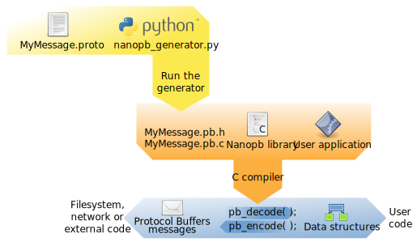

    

Nanopb is an ANSI-C library for encoding and decoding messages in
Google's [Protocol Buffers](https://protobuf.dev/)
format with minimal requirements for RAM and code space. It is primarily
suitable for 32-bit microcontrollers.

Documentation version
---------------------

This documentation applies for nanopb 1.0 and later versions. For
documentation of older releases, see:

* [Nanopb 0.1.x documentation](https://github.com/nanopb/nanopb/blob/maintenance_0.1/docs/index.rst)
* [Nanopb 0.2.x documentation](https://github.com/nanopb/nanopb/blob/maintenance_0.2/docs/index.rst)
* [Nanopb 0.3.x documentation](https://github.com/nanopb/nanopb/blob/maintenance_0.3/docs/index.rst)
* [Nanopb 0.4.x documentation](https://github.com/nanopb/nanopb/blob/maintenance_0.4/docs/index.md)

Overall structure
-----------------

Protocol Buffers is designed as a portable data format for communication between
programs written in any programming language. The format of the communication is
specified in `.proto` files, which look like this:

    message MyMessage {
        required int32 my_numeric_value = 1;
        optional string my_text = 2;
    }

Protocol Buffers libraries then convert between native data representation in the
programming language and the standard [protobuf encoded format](https://protobuf.dev/programming-guides/encoding/).
For nanopb, the native representation is C structures:

    typedef struct MyMessage {
        int32_t my_numeric_value;
        bool has_my_text;
        char my_text[MyMessage_my_text_max_size];
    } MyMessage;

To convert between this C structure and the encoded message format, two functions are used:

    bool pb_decode(pb_decode_ctx_t *ctx, const pb_msgdesc_t *msgdesc, void *dest_struct);
    bool pb_encode(pb_encode_ctx_t *ctx, const pb_msgdesc_t *msgdesc, void *src_struct);

The encoding or decoding context `ctx` defines the storage for the encoded data.
This can be a simple memory buffer, or the data can be directly read or written
to e.g. filesystem or serial port.

The user code processes the C structure `MyMessage`, and provides a pointer to it as `dest_struct` or `src_struct`.

The final part is the middle parameter, `msgdesc`, which has the necessary information
about the structure layout and the `.proto` field definitions to perform the encoding.
This metadata and the C structure definition are automatically created by the nanopb generator:

Parts of the library
--------------------

The `generator/nanopb_generator.py` script is run on the build machine using Python.
It takes as the input the `.proto` files that define the message types.
As the output it writes `.pb.c` and `.pb.h` files that get included in your C program.

The main contents of the generated `.pb.h` files is the C data structure definitions, and
a `FIELDLIST` macro for each message:

    #define MyMessage_FIELDLIST(X, a) \
      X(a, STATIC,   REQUIRED, INT32,    my_numeric_value,   1) \
      X(a, STATIC,   OPTIONAL, STRING,   my_text,            2)

This list of fields is turned into the `pb_msgdesc_t` type at compile time using
C preprocessor macros defined in `pb.h`. It uses standard C features such as `sizeof()` and
`offsetof()` to describe the data layout in the structure, so that it can be processed
at runtime.

The C code for nanopb library itself is in `pb_decode.c`, `pb_encode.c` and `pb_common.c`.
If you only need to encode messages or only need to decode them, you can only include that
part and the common logic. This code reads the `pb_msgdesc_t` description and serializes
the data structures to protobuf on-the-wire encoded format.

So a typical project might include these files:

1. Nanopb runtime library:
    -   pb.h
    -   pb_common.h and pb_common.c (always needed)
    -   pb_decode.h and pb_decode.c (needed for decoding messages)
    -   pb_encode.h and pb_encode.c (needed for encoding messages)

2. Protocol description (you can have many):
    -   my_protocol.proto (the protocol definition)
    -   my_protocol.pb.h (autogenerated, contains type declarations and macros)
    -   my_protocol.pb.c (autogenerated, contains message descriptors)

Features and limitations
------------------------

The main goal of nanopb is to permit processing protobuf messages on microcontroller platforms.
This requires a different kind of implementation than in a protobuf library targeted at PCs.

The differentiating characteristics of nanopb are:

**Features**

1)  Pure C runtime
2)  Small code size (5--20 kB depending on processor and compilation options, plus any message definitions)
3)  Small ram usage (typically \~1 kB stack, plus any message structs)
4)  Allows specifying maximum size for strings and arrays, so that they can be allocated statically.
5)  No malloc needed: everything can be allocated statically or on the stack. Optional malloc support available.
6)  You can use either encoder or decoder alone to cut the code size in half.
7)  Support for most protobuf features, including: all data types,
    nested submessages, default values, repeated and optional fields,
    oneofs, packed arrays, extension fields.
8)  Callback mechanism for handling messages larger than can fit in available RAM.
9)  Extensive set of tests.

**Limitations**

1)  Some speed has been sacrificed for code size.
2)  The deprecated Protocol Buffers feature called "groups" is not supported.
3)  Unknown fields are not preserved when decoding and re-encoding a message.
4)  Reflection (runtime introspection) is not supported. E.g. you can't request a field by giving its name in a string.
5)  Cyclic references between messages are supported only in callback and malloc mode.

Compiler requirements
---------------------

Nanopb 1.0 requires a C compiler supporting the [ISO C99 standard](https://en.wikipedia.org/wiki/C99) or a later version.
Support for C11 is recommended. Versions up to 0.4.x supported older C89 compilers.

Nanopb does not require a full libc to be available, but it does require some basic definitions and utility functions:

1)  `string.h`, with these functions: `strlen()`, `memcpy()`, `memset()`, `memmove()`
2)  `stdint.h`, for definitions of `int32_t` etc.
3)  `stddef.h`, for definition of `size_t`
4)  `stdbool.h`, for definition of `bool`
5)  `stdlib.h`, for definition of `realloc()` and `free()`, unless `PB_NO_MALLOC` build option is used.
6)  `limits.h`, for definition of `CHAR_BIT`

If these header files do not come with your compiler, you can use the
file `extra/pb_syshdr.h` instead. It contains an example of how to
provide the dependencies. You may have to edit it a bit to suit your
custom platform.

To use the pb_syshdr.h, define `PB_SYSTEM_HEADER_NAME` as `pb_syshdr.h`.

Examples
--------

Tutorial projects are in the `examples` folder:

* [examples/simple](../examples/simple/): A basic hello-world level of example, showing the encoding and decoding of one message.
* [examples/network_server](../examples/network_server/): More advanced example, which provides directory listings over a network connection.
* [examples/lowlevel](../examples/lowlevel/): Example of using the low-level encoding and decoding functions for manual processing of protobuf data.

In addition to the examples, the test cases under `tests` cover all nanopb features.
Some of the more interesting ones are:

* [tests/alltypes](../tests/alltypes/): A large message type that shows every supported field type.
* [tests/any_type](../tests/any_type/): Handling variant-type `google.protobuf.Any` messages.
* [tests/cyclic_messages](../tests/cyclic_messages/): Handling cyclic message structure using callbacks.
* [tests/extensions](../tests/extensions/): Handling proto2 format extension fields.
* [tests/framing](../tests/framing/): How to mark message start and end over e.g. serial port connection.
* [tests/map](../tests/map/): Handling `Map` fields.
* [tests/typename_mangling](../tests/typename_mangling/): Remove protobuf package names from C identifiers.

Running the test cases
----------------------

Extensive unittests and test cases are included under the `tests`
folder.

To build the tests, you will need the [scons](http://www.scons.org/)
build system. The tests should be runnable on most platforms. Windows
and Linux builds are regularly tested. The tests also support embedded
targets: STM32 (ARM Cortex-M) and AVR builds are regularly tested.

In addition to the build system, you will also need a working Google
Protocol Buffers `protoc` compiler, and the Python bindings for Protocol
Buffers.

Easiest way to install dependencies is to use the Python package manager
[pip](https://pypi.org/project/pip/), which works on all platforms supported by Python:

    pip3 install scons protobuf grpcio-tools
